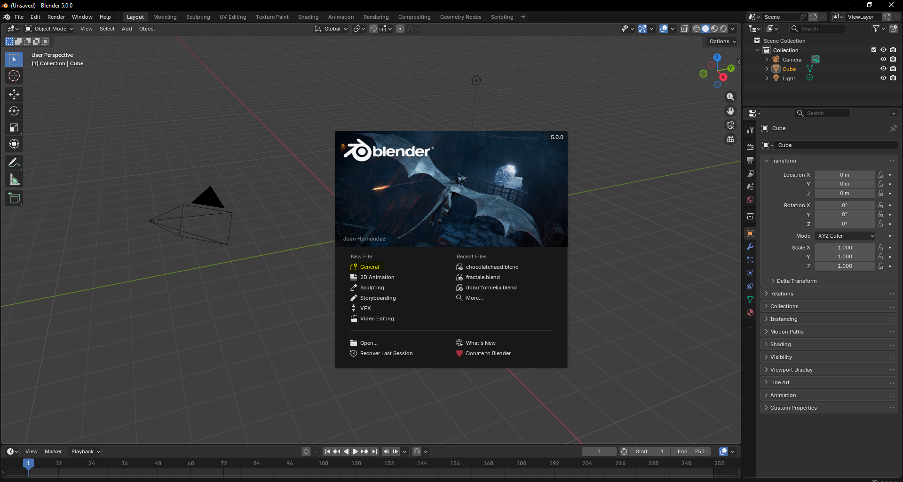
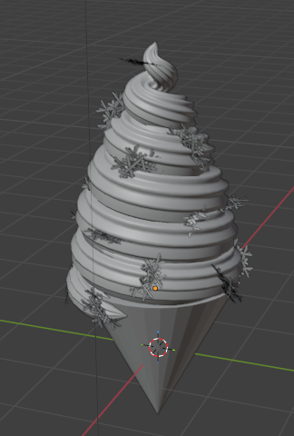
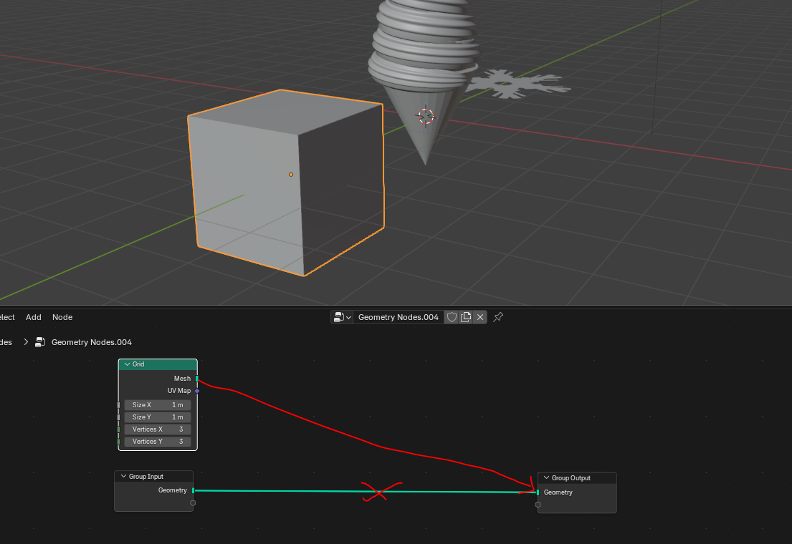
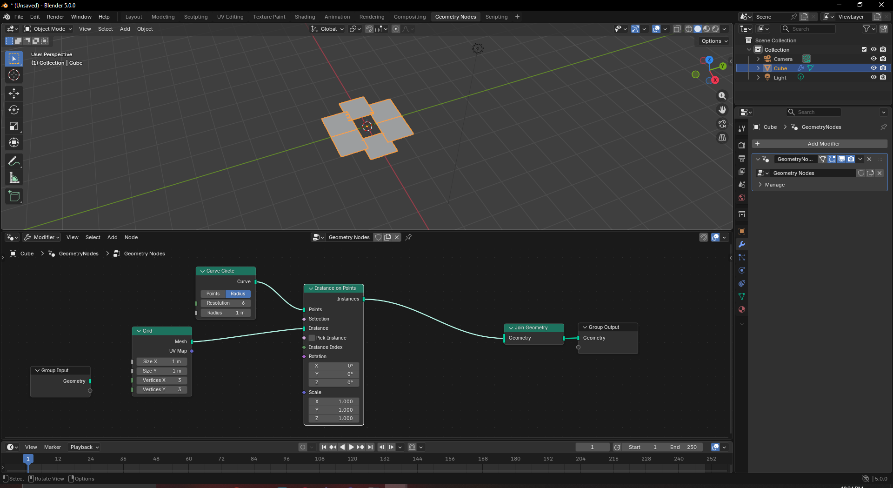
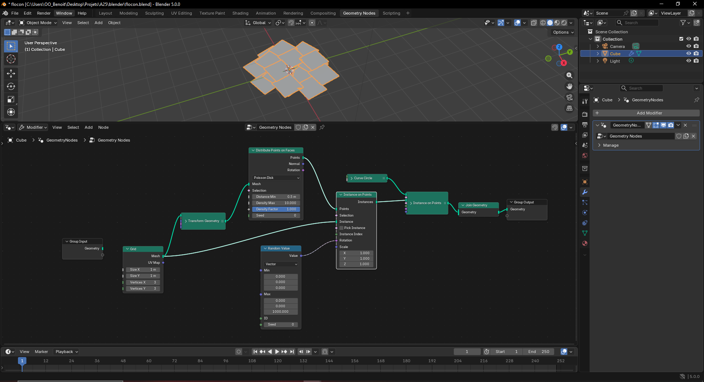
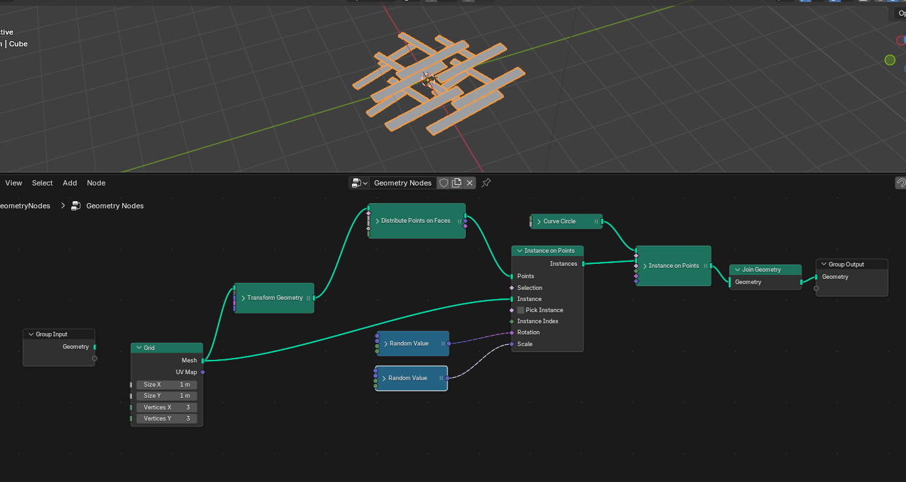
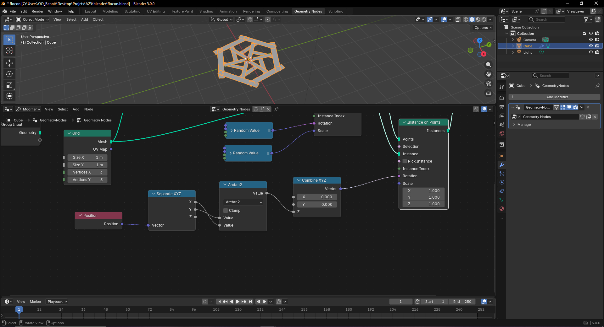
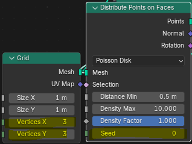
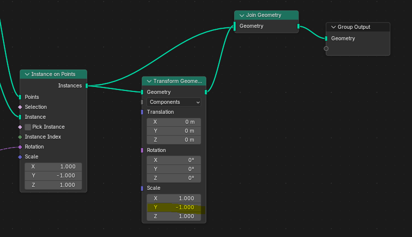
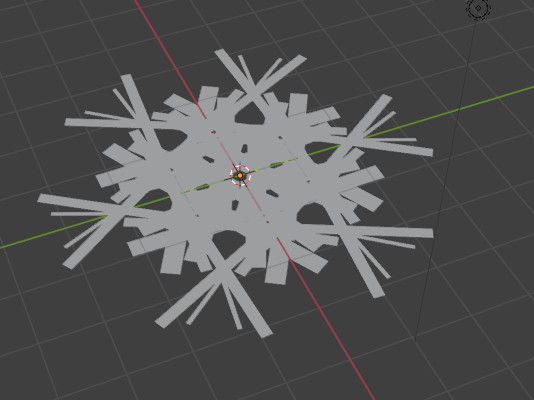

+++
title = "Atelier"
weight = 3
+++

## Étape 1: Installation de Blender
Installer à partir de ce site: https://www.blender.org/download/

Lors de l'installation, simplement choisir les options par défaut.

> [!info]
> Les instructions ainsi que les raccourcis clavier fournis font référence à une installation sous Windows. Il est cependant possible d'effectuer l'atelier avec Linux

Lorsque l'installation est complétée, choisissez `General` comme nouveau fichier.

## Exercice 1: Cornet de crème glacée

Voici le résultat à obtenir:

Lorsque vous créez un nouveau projet, la *mesh* par défaut sera un cube. Pour l'enlever, simplement sélectionner le cube et appuyer sur `x`. Ensuite, avec `Shift`+`a`, ajoutez un **cône**.

Généralement, pour pivoter un objet, il est plus efficace d'utiliser un raccourci clavier (`g`+`r` pour *Grab* + *Rotate*) et de simplement effectuer le pivot visuellement. Cependant, puisque nous sommes en train d'apprendre les nœuds géométriques, nous allons les utiliser afin d'effectuer notre pivot.

Le nœud à utiliser se nomme `Transform Geometry`. À vous de trouver les bonnes valeurs afin d'obtenir le résultat désiré.

Ensuite, en vous basant sur l'exemple de crème fouettée, créez une **spirale** ressemblant à de la crème glacée molle.

> [!tip]
> Pour changer votre point de vue (POV), appuyez sur le bouton central de votre souris (la roulette).
>
> Pour ajuster l'emplacement de votre crème glacée, utilisez `g` pour *Grab* + `x`, `y` ou `z` dépendemment de l'axe choisi.
>
> Pour ajuster la taille, utilisez `g`+ `s` (*Scale*).

Maintenant, ajoutez des *sprinkles* en forme de flocons de neige.

Pour commencer, nous allons créer une *mesh* sur laquelle se baser. Un flocon de neige est considéré comme une fractale. Nous allons donc crééer une fractale 2D. Nous allons également ajouter quelques étapes supplémentaires afin d'apprendre à utiliser de nouveaux nœuds.

### Créer un flocon

> [!tip]- Ajout d'un nœud d'entrée
> Parfois, nous voulons créer des nœuds à partir d'une *mesh* qui n'existe pas dans les *mesh* suggérées lorsqu'on fait `Shift`+`a`. on peut alors simplement ajouter un cube, accéder aux nœuds géométriques à partir de ce cube (en faisant `New`) et, ensuite, ajouter notre nœud d'entrée et retirer le cube.
>
> 

Vous allez débuter par choisir un nœud d'entrée: `Grid`. Ensuite, tel que vu dans les notes de cours, vous devez ajouter un `Instance on Points` et un `Join Geometry`. Cependant, vous n'allez pas joindre le nœud d'entrée au nœud de jonction. Pour l'instant, il servira seulement d'instance. Les `Points` seront des `Curve Circle` avec un `Resolution` de 6.

Maintenant, transformez la grille (`Grid`) à l'aide d'un nœud de transformation (`Transform Geometry`). Changez la valeur de rotation pour X=2°, Y=-2° et Z=4.5°.

Ajoutez ensuite un nœud `Distribute Points on Faces` et changez le type `Random` pour `Poisson Disk`. Ajustez la distance minimale à 0.5m.

Ajoutez de la variété avec un autre nœud `Instance on Points`. Au lieu de simplement dupliquer votre première instance, vous devrez maintenant générer les valeurs de rotation aléatoirement à l'aide d'un nœud `Random Value` utilisant des vecteurs. Pour éviter d'effectuer un rotation sur les axes X et Y, mettez la valeur minimale et la valeur maximale à 0. Mettez une grande valeur maximale pour l'axe Z. 

> [!warning]
> Faites attention à **bien relier vos nœuds** entre eux comme dans la photo ci-haut. Avec l'ajout de nœuds supplémentaires, cela peut vite devenir mélangeant!.

Ajoutez un deuxième nœud qui génère une valeur aléatoire, cette fois-ci en mettant comme valeurs maximales X=0.5, Y=5 et Z=1. Reliez ce nœud `Random Value` au `Scale` du `Instance On Points` que nous sommes en train de paramétrer.

Il faut désormais que tous ces batonnets pointes vers l'extérieur afin d'obtenir un résultat similaire à un flocon de neige. Pour ce faire, il faudra utiliser une fonction mathématique intégrée dans Blender qui s'appelle **Arctan2**.

> [!info]- Fonction atan2
> "En trigonométrie, la fonction atan2 à deux arguments est une **variante de la fonction arc tangente**. Pour tous arguments réels x et y non nuls, atan2(y,x) est l'angle en radians entre la partie positive de l'axe des abscisses d'un plan, et le point de ce plan de coordonnées (x, y). Cet angle est positif pour les angles dans le sens anti-horaire dit sens trigonométrique (demi-plan supérieur, y > 0) et négatif dans l'autre (demi-plan inférieur, y < 0). "
> **[Wikipedia](https://fr.wikipedia.org/wiki/Atan2)

Pour effectuer cela correctement, vous aurez besoin des quatre nœuds suivants: `Combine XYZ`, `Separate XYZ`, `Math` et `Geometry->Read->Position`. Puisque c'est la **rotation des instances** sur point qu'il faut ajuster, connectez le vecteur créé par la combinaison des trois axes à la rotation du nœud `Instance on Points` qui n'a toujours pas de paramètre de rotation (dedvrait être celui de droite). Ensuite, changez la fonction mathématique de votre nœud `Math` pour **Arctan2**. Le vecteur du **nœud de séparation des axes** doit prendre le nœud de lecture de position comme valeur, tandis que son X et son Y prennent, respectivement, la valeur d'en bas et d'en haut du nœud mathématique. Finalement, la valeur fournie par le nœud mathématique doit servir de valeur pour l'axe Z du nœud de combinaison des axes.

> [!tip]
> Pour modifier l'allure de votre flocon, vous pouvez modifier le nombre de *vertices* de votre grille ainsi que le *seed* de votre distribution de points.
>
> 

Vous avez désormais créer une fractale 2D. Vous pouvez améliorer l'allure de votre flocon en symétrisant la géométrie à l'aide d'un transformateur.

En changeant les *vertices* à 2 et le *seed* à -10, vous obtiendrez ce flocon:

**Source**: https://www.youtube.com/watch?v=re37o7JFku8

### Compléter le cornet
> [!tip]
> Comme vu dans les notes de cours, pour mettre des *sprinkles*, il faut sélectionner l'objet sur lequel il faut mettre les *sprinkles*. Dans notre cas, il s'agit d'un objet créé à l'aide de nœuds géométriques. Cet ensemble de nœuds se trouve dans un *modifier* que l'on retrouve à droite. Vous pouvez ajouter un *modifier* afin d'ajouter un nouveau groupe de nœuds sans se tromper avec les nœuds qui servent à créer la crème glacée.
>
> `Add Modifier` -> `Geometry Nodes`

Ajoutez les flocon comme *sprinkle* au cornet en suivant les instructions données en notes de cours. Vous devez trouver comment ajouter une rotation aléatoire pour obtenir un résultat similaire à l'exemple illustré ci-haut. 