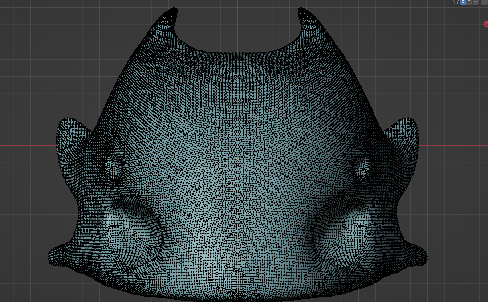
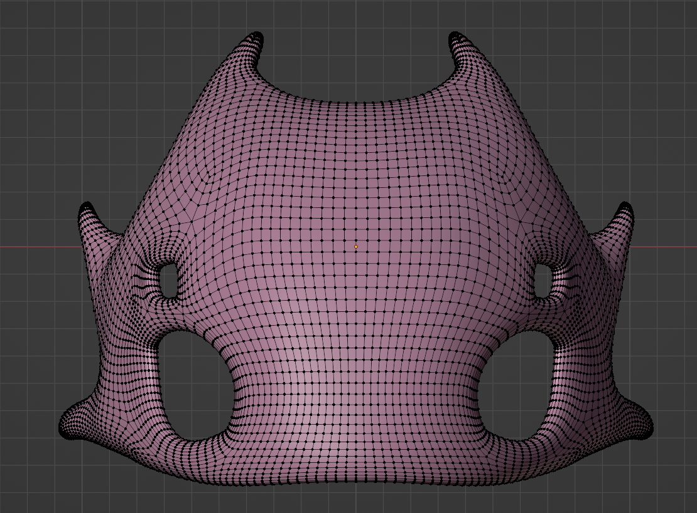
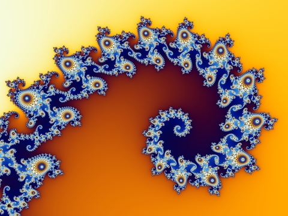
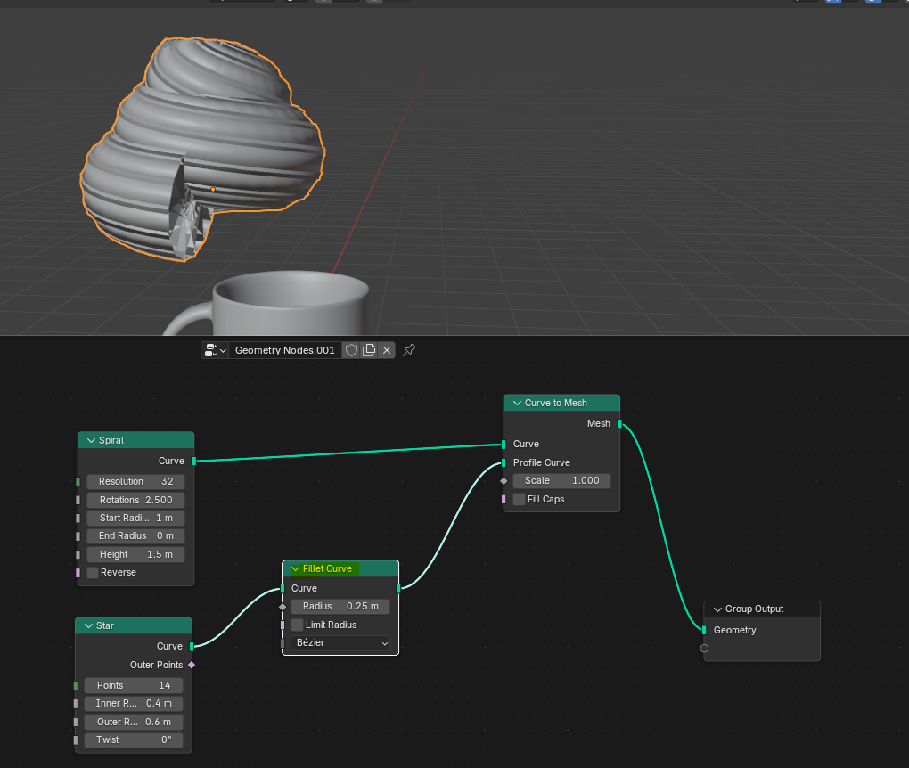
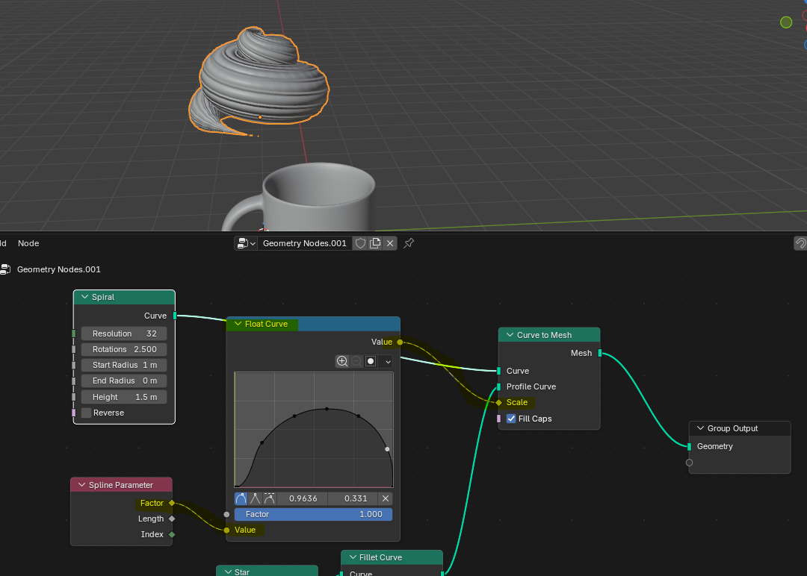
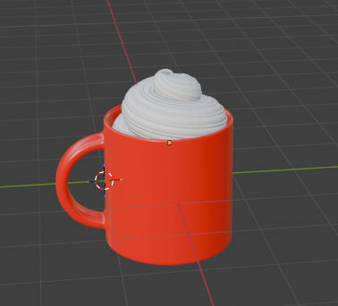
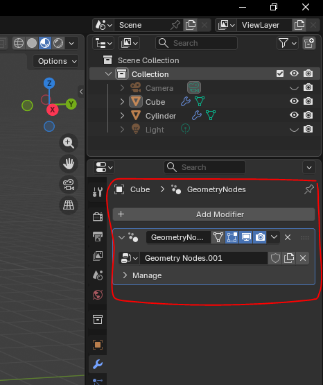

+++
title = "Notes de cours"
weight = 2
+++

## Blender
Blender est un logiciel libre (*open source*) utilisé pour la création 3D. Il a été créé en 1994 et est actuellement développé par la Fondation Blender.

Il permet de faire la modélisation (création des objets), l'animation, la simulation, le rendu (*render*) ainsi que du montage vidéo. Avant la version 5.0, qui vient tout juste de sortir, le montage vidéo n'était pas assez bien développé pour remplacer un autre outil comme *DaVinci Resolve*. Maintenant, Blender devient un choix intéressant pour le montage.

Dans ce cours, nous allons nous concentrer sur la modélisation 3D, spécifiquement à l'aide des nœuds géométriques. 

## Termes à apprendre
**Maillage (*mesh*)**: Grilles polygonale qui permet de créer et de mofifier des objets en indiquant une valeur pour les points/sommets (*vertices*), les arêtes (*edges*) et les faces.

> "Un **maillage polygonal** ou ***polygon mesh*** est un objet tridimensionnel constitué de sommets, d'arêtes et de faces organisés en polygones dans une infographie tridimensionnelle. Les faces se composent généralement de triangles, de quadrilatères ou d'autres polygones convexes simples, car cela simplifie le rendue."
> **[Wikipedia](https://fr.wikipedia.org/wiki/Maillage_polygonal)**

**Retopologie (*retopo*)**: Étape de production où un modèle 3D est recopié en nettoyant le maillage (diminuer le nombre de polygones) afin de faciliter l'animation et d'optimiser les performances. 

| Avant         | Après         |
|---------------|---------------|
|  |  |
> Images créées par Gabriel Borduas

> [!tip]- Plus de détails
> 

## Modélistion simple
Pour créer des objets, il faut d'abord créer une forme approximative, voir brouillon, en utilisant des polygones. Ensuite, à partir de cette forme de base, il faut sculpter les polygones afin d'obtenir un objet plus défini. Ce sculptage augmente généralement drastiquement le nombre de polygones, ce pourquoi il est nécessaire d'effectuer une retopologie.

## Nœuds Géométriques (*Geometry Nodes*)
Même s'il serait peut-être préférable que j'explique dans mes mots, j'ai trouvé une explication tellement bonne que je considère qu'il est mieux de la citer plutôt que d'essayer de la retranscrire:

> "Imagine ça comme des LEGO pour la géométrie: chaque nœud fait un petit boulot, et quand tu les connectes, ils travaillent ensemble pour façonner, déplacer ou modifier ton objet 3D de manière stylée.
>
> Dans Blender, tout est construit à partir de sommets, d'arêtes et de faces. Les nœuds géométriques te permettent de contrôler ces éléments par programmation.
> 1. **Nœuds d'entrée**: Ils te donnent des informations (comme la position de chaque somment)
> 2. **Nœuds de traitement**: Ils changent ou modifient la géométrie (comme déplacer, mettre à l'échelle ou dupliquer des parties d'un *mesh*)
> 3. **Nœuds de sortie**: Ils renvoient l'objet modifié vers la vue de Blender
>
> Tu crées des effets en connectant ces nœuds dans un arbre de nœuds, comme un organigramme. Les données circulent à travers les nœuds, et chaque nœud change quelque chose en cours de route.
>
> [...] **[Reddit](https://www.reddit.com/r/blenderhelp/comments/1ji4opj/simplest_way_to_understand_and_explain_geometry/)**

> [!NOTE]- Note sur la *mesh*
> Lorsqu'on modifie la position de l'objet à l'aide d'un nœud géométrique, le maillage, lui, ne bouge pas.
>
> 

Nous allons aborder plus en détails les nœuds géométriques à l'aide d'exemples concrets. Par la suite, une fois que nous aurons mieux saisi le concept des nœuds géométriques, nous allons faire le parallèle avec la programmation telle que nous la connaissons.

## Exemples
Pour ce genre de théorie, il est plus facile d'apprendre en se pratiquant. Nous allons donc explorer en profondeur les nœuds géométriques en expérimentant.

>[!NOTE]
> Sur ma VM qui utilise Linux comme système d'exploitation, Blender roule trop lentement pour être utilisable. Tous les exemples fournis viendront donc de ma machine hôte qui utilise **Windows** comme système d'exploitation.

---

### 1. Scattering
> [!TIP] Petit Rappel
> Le *scattering* est la génération automatique de grandes quantités d'objets.

Pour expliquer le *scattering*, nous allons générer des *sprinkles* et les placer sur un beigne.

Puisque nous voulons se concentrer sur les nœuds géométriques, nous passerons par-dessus les étapes de modélisation du beigne et du *sprinkle*. Nous allons simplement voir comment créer, à l'aide de nœuds, plusieurs instances placées aléatoirement du *sprinkle*.

---

Voici comment accéder aux nœuds géométriques:

1. Ouvrir le panneau `Geometry Nodes`
2. Sélectionner un nœud d'entrée. Nous sélectionnons d'abord le glaçage et non le *sprinkle* puisque nous voulons mettre les *sprinkles* sur le glaçage. Le glaçage étant donc affecté, il faut l'ajouter.
3. Appuyer sur `new` pour créer le nœud d'entrée.

Voici le résultat attendu:

> [!tip]- Rappel sur les nœuds d'entrée
> Le nœud d'entrée (boîte de gauche) fait référence au **maillage** (*mesh*) du glaçage. Il est possible de l'afficher en faisant `tab`.
> 

Nous allons désormais ajouter un nœud de traitement qui permet de distribuer des points sur une face: `shift`+`a` (a pour *add*), ensuite `Point` puis `Distribute Points on Faces`.

Comme nous avons vu précédemment, le nœud de sortie renvoie l'**objet modifié**. La distribution de points sur le glaçage est une conversion de l'objet initial, alors seuls les points seront retournés et affichés.

Il est possible de remédier à ce problème en ajouter un nœud de jonction (qui est en fait un simple de nœud de traitement qui effectue une jonction): `shift`+`a` -> `Geometry` -> `Join Geometry`. 

Un autre problème que nous avons est le suivant: 

**Que faire si je veux distribuer un objet préalablement modeler?**

Il suffit simplement de: 
1. Ajouter un `Instance on Points`: `shift`+`a` -> `Instances` -> `Instance on Points`
2. Ajouter un nœud contenant les informations de l'objet avec un simple glisser-déposer (*drag and drop*) 
3. Relier l'instance avec la géométrie de l'objet créé préalablement
4. Relier cette instance de points avec les points qui sont sur le glaçage.

---

### 2. Effets complexes difficiles à modeler
Cette fois-ci, créons une fractale à l'aide de nœuds géométriques.

> [!tip] Fractale
> Une fractale est un objet mathématique ou naturel caractérisé par une structure similaire à toutes les échelles, c'est-à-dire que les détails complexes apparaissent au fur et à mesure qu'on *zoome* sur l'objet. Les flocons de neige en sont un excellent exemple.
>
> 
> Image: [Wikipedia](https://fr.wikipedia.org/wiki/Fractale)

Tout d'abord, il faut créer un objet de base. Nous allons choisir une `Ico Sphere` avec une seule subdivision:

Ensuite, Pour créer la première itération, il faut utiliser le nœud de traitement `Instance on Points` ainsi que le nœud de jonction `Join Geometry` tel que vu précédemment. Cependant, au lieu de relier l'instance avec la géométrie d'un tier objet, nous allons la relier à la géométrie du nœud d'entrée.

Pour ajouter des instances, il suffit de recopier tous les nœuds, incluant le nœud d'entrée. Pour dupliquer un nœud, il suffit de faire `Shift`+`D`.

> [!NOTE]
> Il faut faire attention à ne pas trop ajouter d'itérations car, autrement, l'objet final sera très lourd à processer. Pour cette raison, nous allons nous arrêter à **4 instances**.
>
> 

Présentement, toutes nos instances d'ico sphère sont pleines. Avec d'autres nœuds, il est possible de les vider, c'est-à-dire de les rendre creuse (*hollow*). Nous allons utiliser les nœuds `Mesh to Curve`, `Curve to Mesh` et `Curve Circle`.

> [!info]- Mesh to Curve
> Le nœud `Mesh to Curve` permet de convertir un maillage (*mesh*) en une ou plusieurs courbes (*splines*). Ces courbes sont basées sur les arêtes ou les faces du maillage d'origine.
> - **Arêtes (*Edges*)**: Chaque chaîne d'arêtes connectées du maillage devient une *spline*. Les intersections d'arêtes (où plus de deux arêtes se rejoignent) créent des ruptures dans la *spline*.
> - **Faces**: Chaque face du maillage est transformé en *spline* cyclique (boucle fermée).
>
> | Avant       | Après         |
> |-------------|---------------|
> |  |  | 
>
> Nous allons voir d'autres applications de ce nœud à l'exemple suivant.

Évidemment, la fractale aura un résultat similaire, mais différent, dépendemment de la forme de départ.

---

### 3. Adaptation d'un objet à une courbe
Maintenant, nous allons créer de la crème fouettée afin d'apprendre à adapter un objet à une courbe. 

Pour commencer, nous allons ajouter une spirale à partir des nœuds géométriques. Nous allons également ajouter un nœud `Curve to Mesh` afin que cette spirale soit maillée, la rendant ainsi un véritable objet.

Pour avoir la forme de la spirale voulue, il suffit simplement de changer les paramètres du nœud:

| Paramètre  | Valeur |
|------------|--------|
| Resolution | 32     |
| Rotations  | 2.5    |
| Start Radius | 1m   |
| End Radius | 0m     |
| Height     | 1.5m   |

Ensuite, au lieu de modeler nous-mêmes la forme de la crème fouettée, nous allons plutôt utiliser une forme de courbe appelée `Star` qui peut être générée grâce à un nœud. Cette courbe sera notre `Profile Curve` (courbe de profil).

Pour arrondir les arêtes de l'étoile, il faut utiliser le nœud `Fillet Curve`.

| Avant     | Après     |
|-----------|-----------|
|  |  |

Finalement, il reste à peaufiner notre spiral en amincissant les extrêmités. Pour ce faire, nous allons programmé une courbe de valeurs (similaire à une parabole) et injecter cette courbe de valeurs au rayon de la spirale. Nous aurons besoin d'un nœud `Float Curve` et d'un nœud `Spline Parameter`.

## Les nœuds géométriques et la programmation
Jusqu'à maintenant, ce que nous avons vu ne ressemble pas vraiment à de la programmation. On pourrait alors se demander pourquoi sommes-nous en train de voir tout ça. En fait, les nœuds géométriques sont une forme de **programmation visuelle**. 

Chaque **nœud** est équivalent à une **fonction**. En tant que tel, ces nœuds sont des interfaces visuels reflettant le code qui se cache en arrière (généralement Python ou C++). L'exécution de toutes ces fonctions se retrouve dans un bloc appelé `Modifier`. On retrouve ces blocs typiquement à droite de l'écran et chaque bloc s'exéute en ordre du plus haut au plus bas.

Les **liens** entre les nœuds (*wires*) sont des **flux de données**. D'un nœud à l'autre, d'une fonction à l'autre, ces données sont reçues, traitées et retournées. Cependant, on ne parle pas de données du style "nom", "email", etc., mais bien de valeurs équivalentes aux sommets, arêtes et faces des objets.

Les données passent donc d'une fonction à l'autre selon un certain ordre, suivant ainsi les principes de **programmation procédurale** que nous connaissons si bien.

Ce que nous avons vu de concret, jusqu'à maintenant, était de très bas niveau, mais il est également possible d'effectuer des `if`/`else` avec des nœuds (`If nodes`). La liste de possibilités est infinies, et si vous réussissez à ne pas trouver ce que vous cherchez, il est toujours possible de créer ses propres scripts pythons.

## Sources
- **Gabriel Borduas**, étudiant autodidacte
- Wikipedia
- Reddit
- Blender
- **Blender Guru** (https://www.youtube.com/watch?v=TLrA6eJOfqk)
- **Khamurai** (https://www.youtube.com/watch?v=ZbLogSN8Euc)
- **Savoir pour tous** (https://www.youtube.com/watch?v=AOHGnIdOuZQ)
- **La nouvelle École - DIY** (https://www.youtube.com/watch?v=Y42rtLQpi7Q)